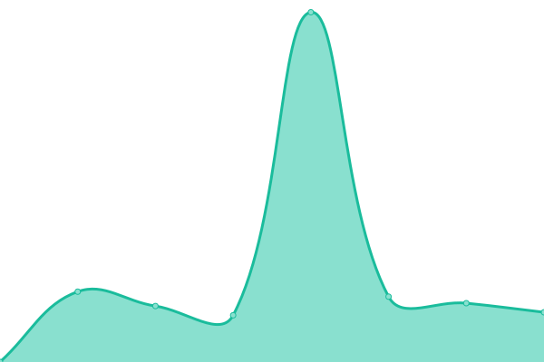

# [📈 Live Status](https://status.pdkg.org): <!--live status--> **🟩 All systems operational**

This repository contains the open-source uptime monitor and status page for [KPGhelpdesk](https://status.pdkg.org), powered by [Upptime](https://github.com/upptime/upptime).

With [Upptime](https://upptime.js.org), you can get your own unlimited and free uptime monitor and status page, powered entirely by a GitHub repository. We use [Issues](https://github.com/KPGhelpdesk/upptime/issues) as incident reports, [Actions](https://github.com/KPGhelpdesk/upptime/actions) as uptime monitors, and [Pages](https://status.pdkg.org) for the status page.

<!--start: status pages-->
<!-- This summary is generated by Upptime (https://github.com/upptime/upptime) -->
<!-- Do not edit this manually, your changes will be overwritten -->
<!-- prettier-ignore -->
| URL | Status | History | Response Time | Uptime |
| --- | ------ | ------- | ------------- | ------ |
|  [Paardekooper Servicedesk Portal](https://pdkg.topdesk.net) | 🟩 Up | [paardekooper-servicedesk-portal.yml](https://github.com/KPGhelpdesk/upptime/commits/HEAD/history/paardekooper-servicedesk-portal.yml) | 

 705ms
     
 | 

<a href="https://status.pdkg.org/history/paardekooper-servicedesk-portal">100.00%</a>
    

|  [Paardekooper Webshop](https://www.paardekooper.nl) | 🟩 Up | [paardekooper-webshop.yml](https://github.com/KPGhelpdesk/upptime/commits/HEAD/history/paardekooper-webshop.yml) | 

 1511ms
     
 | 

<a href="https://status.pdkg.org/history/paardekooper-webshop">98.77%</a>
    

<!--end: status pages-->

[**Visit our status website →**](https://status.pdkg.org)

## 📄 License

- Powered by: [Upptime](https://github.com/upptime/upptime)
- Code: [MIT](./LICENSE) © [KPGhelpdesk](https://status.pdkg.org)
- Data in the `./history` directory: [Open Database License](https://opendatacommons.org/licenses/odbl/1-0/)
